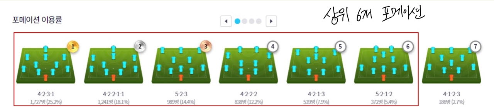
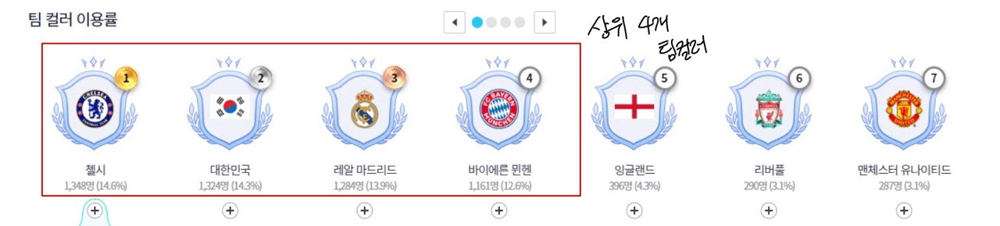
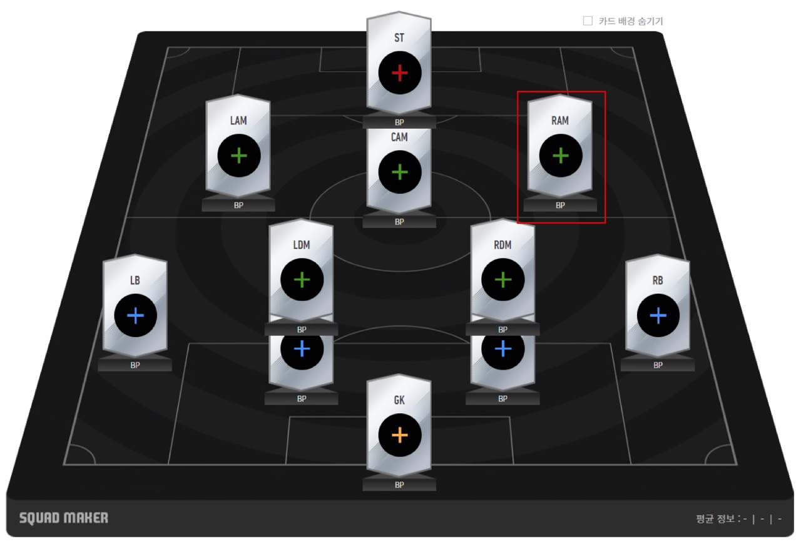
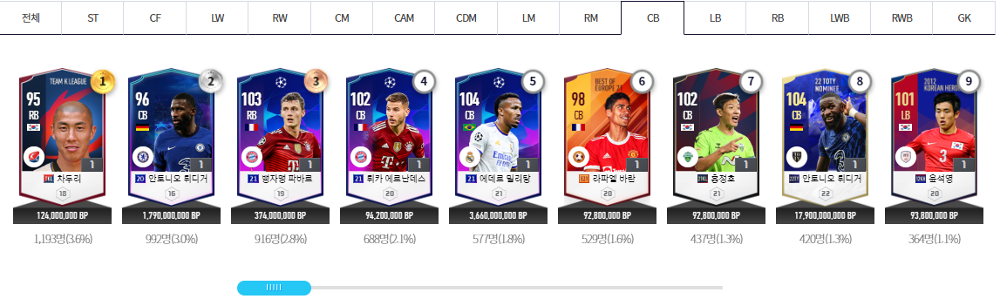
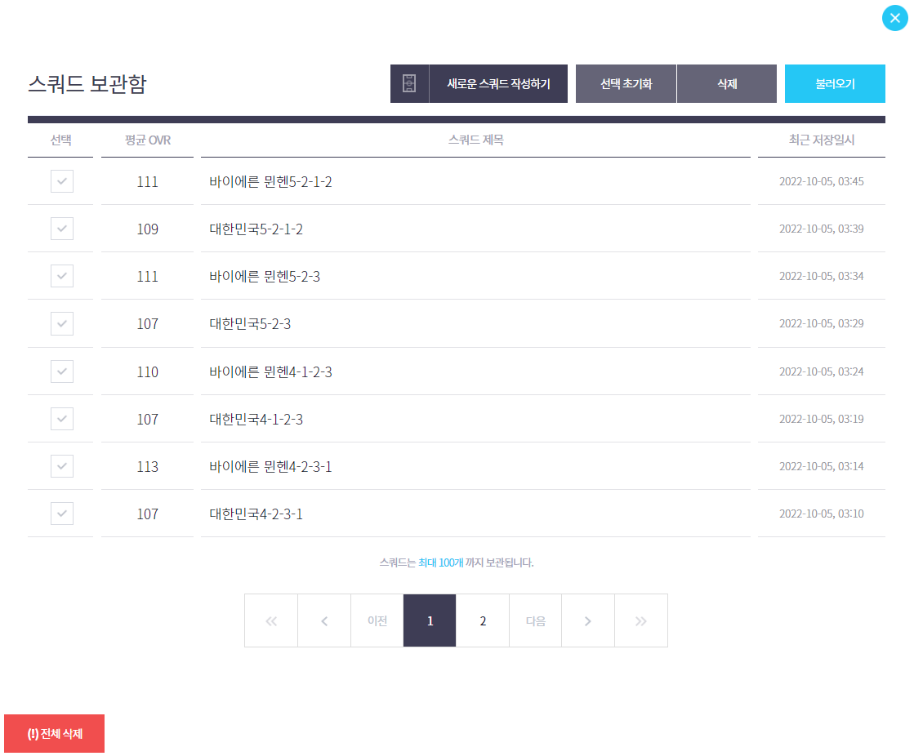

# 스쿼드메이커를 이용한 자동 스쿼드 제작 시스템

- Scrap_PlayersData.ipynb를 먼저 실행시켜 데일리 차트 기준 총 15개의 포지션 중 가장 인기 많은 선수 16명씩 총 240명에 대한 데이터 추출
- 추출한 데이터를 csv 파일로 저장하고, 이 데이터를 기반으로 Auto_squadmaker.ipynb에서 불러와 지정한 팀 컬러에 해당되는 스쿼드 제작에 활용한다.
- Scrap_PlayerData.ipynb에서 선수 정보 추출 시 시간이 상당히 걸리므로 시간 제약이 있을 시엔 players_data에 미리 추출해둔 csv 파일을 기준으로 Auto_squadmaker를 작동시키면 된다.
  - 2022년 10월 1일 기준 데이터이다.

## 프로세스

1. 데일리차트에서 포지션별 인기 선수들의 시즌, 이름, 포지션을 추출한다.

2. 인기 포메이션 6개 중 하나를 선정한다. (피온4 데일리차트 기준)
   - 인기 순으로 하려고 하였으나, 포메이션이 너무 유사하여 결과가 비슷하게 나오므로 시스템 구현 시엔 포메이션을 임의로 재설정하였다.
     - ex) 4-2-3-1, 4-2-1-3, 4-2-2-1-1은 결과가 100% 동일하게 나와 차별성이 없음
     - 
3. 선정한 상위 4개의 팀 컬러 중 하나를 팀 컬러 검색창에 입력
    - 데일리차트 기준 상위 4개의 팀컬러를 리스트에 저장
    - 시스템 구현 시에는 시간상의 이유로 2개의 팀컬러만 활용할 예정
    - 
4. 전제조건

    1) 포지션별로 선수 입력 시 PlayersData에 있는 선수들을 먼저 입력한다. 단 포지션별로 반영할 데이터의 범위는 자체적으로 선정한다.
        - ex) 스쿼드메이커에서 LAM,RAM 자리는 PlayersData의 포지션이 LW,RW,LM,RM인 선수들 중에서 검색하여 활용
        - 
        - 검색을 모두 완료하였음에도 없는 경우에는 공란으로 남겨둔다.
    
    2) 선수의 포지션은 선수 카드에 주어진 포지션이 아니라 유저들이 사용한 포지션을 따른다.
        - ex) TKL 차두리의 원래 포지션은 RB이지만, 유저들은 CB으로 주로 사용하므로 TKL 차두리는 CB로 분류한다.
        - 
        
    3) 스쿼드 작성 순서는 공격진부터 골키퍼 순으로 작성
        - 일반적으로 공격진부터 스쿼드를 짜기 때문이다.
    
5. PlayersData에 해당 선수가 존재하는 경우, 해당 선수의 이름과 시즌이 일치하는지 확인한 후 스쿼드에 포함

    - 이름 검색 시 여러 선수가 검색되는 경우도 있으므로(TKL 김태환의 경우 동명이인이 함께 검색됨) 이름, 시즌 전부 확인
    - 포지션별 인기 순으로 정렬된 것이므로 PlayersData 위에서부터 선수 이름 검색해서, 해당 선수가 존재하면 포함하면 된다.

6. 급여 초과 여부는 무시한다.
7. 팀 컬러는 클럽 컬러, 국가 컬러만 고려한다.
    - 클럽 컬러는 맨시티, 첼시, 레알 마드리드와 같이 클럽
    - 국가 컬러는 대한민국, 잉글랜드, 독일과 같이 국가를 의미

8. 결과
    - 
    - 지정한 팀 컬러와 포메이션을 스쿼드 제목으로 정하여 저장한 모습이다.

# 총평
> 이번 개인 프로젝트를 진행하며 내가 느꼈던 부분을 정리한다.

## 좋았던 점

1. 주제가 상당히 신선하였다. 그로 인해 배우는 부분이 많았다.
   
    - 보통 데이터 다루는 법을 배우면 맛집 추천, 음원사이트 차트 조사 등의 많이 보편화 되어 있는 주제를 이용한 실습을 하는데, 나는 보다 신선한 주제를 가지고 실습을 해보고 싶어 해당 주제를 선정하였다.
    - 주제가 굉장히 신박하였던 만큼 참조할 만한 자료가 전무하였고, 그만큼 시행착오가 많았지만 데일리차트와 스쿼드메이커를 면밀히 분석하여 나에게 필요한 데이터를 결국에 가져오는 것을 성공하였다.
    

2. 신선한 주제로 인해 배우는 부분이 많았다.

   - 특히나 스쿼드메이커를 다룰 때 동적 애니메이션이 많은 페이지라 조금이라도 알고리즘이 어긋나면 에러가 발생하여 위험변수를 최대한 줄이려고 노력하였고, 그만큼 가장 많은 시간을 투자하였고 그 과정에서 상당한 실력단련을 할 수 있었다.
   - 교육 수강하며 배웠던 부분 외에 그에 파생된 응용 영역을 구글링하고 나 나름대로 변형하고 이를 적용을 적극적으로 한 부분이 성공적으로 데이터를 가져올 수 있었던 요인이라고 생각한다.

## 아쉬웠던 점

1. 프로세스 자체는 문제가 없지만, selenium 기반의 동적 크롤링이다 보니 너무 느려 서비스적인 차원에서는 다소 비효율적이다.
   
    - 비록 데이터 분석 실습 목적으로 시작한 프로젝트이지만, 아쉬운 것은 사실이다.
    - 추후 해당 프로세스를 보다 효율적으로 구동할 수 있는 방법을 고안할 것이다.

2. 변수와 위험 요소를 수도 없이 고려하였지만, 아직까지도 남아 있다.

    - 변수를 차단하기 위해 많은 가정과 전제사항을 설정하고 가동한 프로그램이라, 이러한 부분이 많아 아직까지 완전한 프로그램이 아니라고 생각한다.
    - 사전 제한사항을 최소화하고도 완전히 프로그램이 가동되어야 완벽한 프로그램이므로 지속적인 피드백을 통해 보다 완전한 프로그램으로 만들 것이다.
    - 변수를 완전히 제거하였다고 판단되면 시연 영상 또한 업로드할 계획

> 출처: 피파온라인4 데일리차트